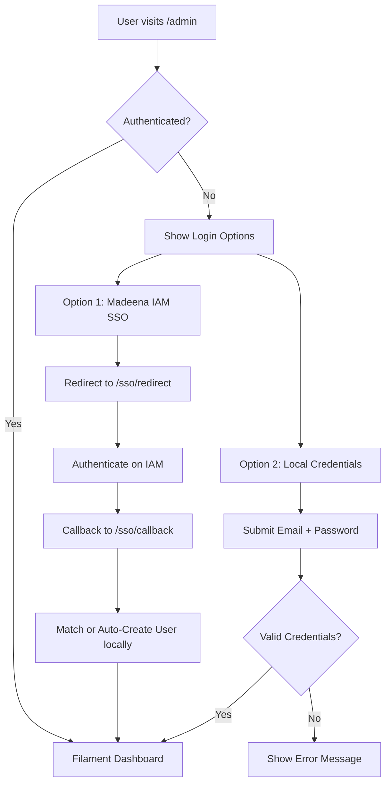
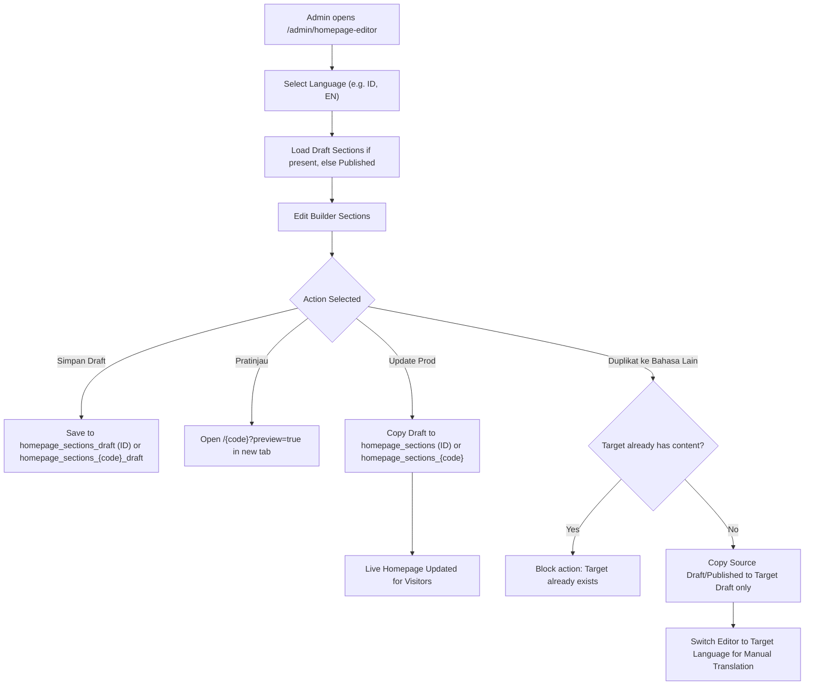
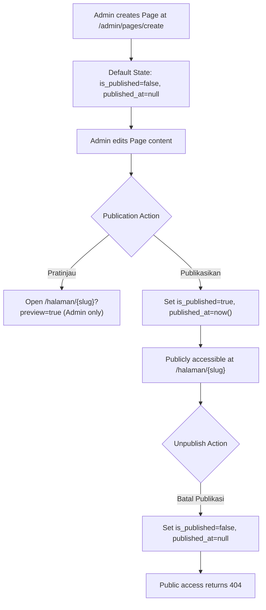
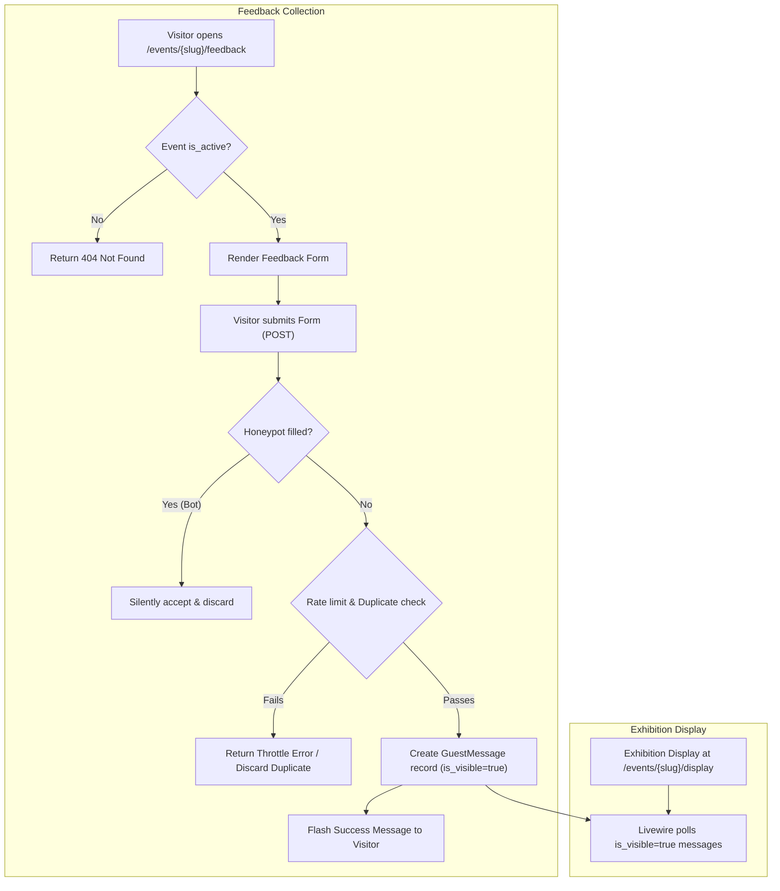
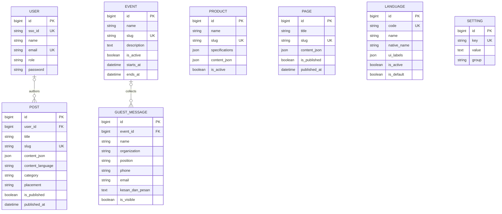

# Product Requirements Document (PRD)
# Madeena Company Profile

> **Status**: Approved Living Document
> **Version**: 3.2 (Synchronized with Cumulative Database Migration Schema Truth)
> **Repository**: [https://github.com/Madeena-software/madeena-company-profile](https://github.com/Madeena-software/madeena-company-profile)

---

## 1. Product Overview

### 1.1 What is Madeena Company Profile?

**Madeena Company Profile** is the official corporate web platform for **PT Madeena Karya Indonesia**, an Indonesian medical imaging manufacturer specializing in Digital Direct Radiography (DDR) systems based on Camera Coupled X-Ray Detector (CCXD) technology commercialized from Universitas Gadjah Mada (UGM) research.

The platform serves two primary audiences:
1. **Public Stakeholders & Clinical Visitors**: Prospective clients, healthcare facility operators, researchers, and regulatory bodies seeking product technical specifications, scientific literature, corporate certifications, and event interaction.
2. **Internal Content Administrators & Researchers**: Content creators and administrative staff utilizing an intuitive, elderly-friendly Filament v5 CMS to manage dynamic multilingual landing pages, academic publications, product catalogs, and corporate events.

### 1.2 Tech Stack Summary

| Layer | Technology | Version / Specification |
|---|---|---|
| Backend Framework | Laravel (PHP) | 13.x / PHP 8.4 |
| Admin Panel | Filament PHP | 5.x (Livewire 3) |
| Editor Engine | Tiptap (RichEditor) | Academic custom blocks |
| Math Typesetting | KaTeX | 0.17 (via NPM) |
| Frontend CSS | Tailwind CSS | 4.0 |
| Frontend JavaScript | Alpine.js | 3.15 |
| Build Tool | Vite | 6.x |
| Database | MySQL | 8.4 |
| Application Server | Nginx + PHP 8.4-FPM | Multi-stage Alpine container |
| Object Storage | MinIO (S3-compatible) | `league/flysystem-aws-s3-v3` |
| Identity & Auth | Madeena IAM SSO | OAuth2 (`socialiteproviders/laravelpassport`) |
| Container Orchestration | Docker Swarm | Stack deployment via GitHub Actions runner |
| CI/CD Pipeline | GitHub Actions | Workflows under `.github/workflows/` (dispatched via `workflow_dispatch`) |
| Development Server Port | `8011` | `composer dev` executes `php artisan serve --port=8011` |

### 1.3 Key Public & Administrative URLs

| URL Pattern | Purpose | Auth Required |
|---|---|---|
| `/` | Default language homepage (resolved via `Language::getDefault()`, e.g. `id`) | No |
| `/{locale}` | Localized homepage for active language (e.g. `/en`) | No (Active only; Admin for preview) |
| `/en` | Shortcut convenience/compatibility route to English homepage (`HomeController::indexEn()`) | No |
| `/artikel` | Academic article and research publication index | No |
| `/artikel/{post:slug}` | Individual academic article detail page with KaTeX equations and citations | No |
| `/produk/{product:slug}` | Product specification and detail page | No |
| `/halaman/{page:slug}` | Custom static page (requires publication or admin preview) | No |
| `/events/{event:slug}/feedback` | Public event guestbook feedback form (requires active event) | No |
| `/events/{event:slug}/feedback/csrf-token` | Rate-limited CSRF token refresh endpoint for feedback form (requires active event) | No |
| `/events/{event:slug}/display` | Real-time Livewire display for live event exhibition boards (not active-gated) | No |
| `/inabuyer2026/feedback` | Legacy redirect to `/events/inabuyer-2026/feedback` | No |
| `/inabuyer2026/display` | Legacy redirect to `/events/inabuyer-2026/display` | No |
| `/storage/{path}` | Public object storage proxy serving S3 media assets | No |
| `/health` | JSON database connectivity check | No |
| `/up` | Application health endpoint | No |
| `/admin` | Filament CMS administrative control panel | Yes (`admin` / `user`) |
| `/sso/redirect` | Redirects user to Madeena IAM for SSO authentication (`prompt=login`) | No |
| `/sso/silent` | Silent SSO check redirecting to Madeena IAM with `prompt=none` | No |
| `/sso/callback` | OAuth2 callback handler from Madeena IAM | No |
| `/test-support/login` | Automated testing support login endpoint | Local/Testing only |

---

## 2. User Personas & Access Control

### 2.1 Personas

1. **Public Visitor**
   - General public, medical facility procurement teams, clinical researchers, and event attendees.
   - Read-only access to published public content across active languages; ability to submit event feedback during active events and view exhibition display boards.
2. **System Administrator (`role: admin`)**
   - Corporate leadership and IT managers (e.g. Prof. Gede Bayu Suparta).
   - Full administrative control over all CMS resources, Homepage layout, Language registry, Site Settings, Page publication, Event management, and User accounts.
3. **Contributing Author / Researcher (`role: user`)**
   - Clinical researchers and academic writers.
   - Restricted panel access: can compose and manage their own academic articles only.

### 2.2 Access Control Matrix

| Feature / Resource | Admin | User | Public |
|---|---|---|---|
| Public Homepage & Active Localized Pages | 👁️ | 👁️ | 👁️ |
| Inactive Language Homepage Preview | 👁️ (`?preview=true`) | ❌ | ❌ |
| Product & Article Public Detail Pages | 👁️ | 👁️ | 👁️ |
| Custom Pages (`/halaman/{slug}`) | 👁️ (Draft & Published) | 👁️ (Published only) | 👁️ (Published only) |
| Event Feedback Form (`/events/{slug}/feedback`) | 👁️ ✍️ | 👁️ ✍️ | 👁️ ✍️ (Active events only) |
| Event Live Display (`/events/{slug}/display`) | 👁️ | 👁️ | 👁️ (All existing events) |
| Filament CMS Dashboard | ✅ | ✅ | ❌ |
| Homepage Editor (`/admin/homepage-editor`) | ✅ Full CRUD / Publish | ❌ Hidden | ❌ |
| Language Registry (`/admin/languages`) | ✅ Full CRUD / Default | ❌ Hidden | ❌ |
| Product Management (`/admin/products`) | ✅ Full CRUD | ❌ Hidden | ❌ |
| Article Management (`/admin/posts`) | ✅ Full CRUD (All) | ✅ CRUD (Own posts) | ❌ |
| Custom Page Management (`/admin/pages`) | ✅ Full CRUD / Publish | ❌ Hidden | ❌ |
| Event Management (`/admin/events`) | ✅ Full CRUD | ❌ Hidden | ❌ |
| Guest Message Moderation (`/admin/guest-messages`) | ✅ Visibility Toggle | ❌ Hidden | ❌ |
| Site Settings (`/admin/site-settings`) | ✅ Full Edit | ❌ Hidden | ❌ |
| User Administration (`/admin/users`) | ✅ Full CRUD | ❌ Hidden | ❌ |

---

## 3. Feature Inventory & Product Boundaries

### 3.1 Implemented Capabilities

#### F-001: Dynamic Multilingual Homepage & Section Builder
- **Status**: Implemented
- **Description**: Full-page responsive landing constructed via Filament's Builder blocks. Supports separate draft and published states per language.
- **Key Mechanics**:
  - **Indonesian Legacy Storage Invariant**: Indonesian (`id`) permanently maps to unsuffixed Setting keys `homepage_sections` (published) and `homepage_sections_draft` (draft).
  - **Non-Indonesian Languages**: Every non-Indonesian language maps to language-scoped keys `homepage_sections_{code}` and `homepage_sections_{code}_draft` (e.g. `homepage_sections_en`, `homepage_sections_ja`). This rule holds even if a non-Indonesian language is set as default.
  - Admin can save draft (`💾 Simpan Draft`), preview via `?preview=true`, and promote draft to live production (`🚀 Update Prod`).
  - Active/inactive toggle on languages restricts public visibility while allowing administrative preparation and private preview.
  - Duplication tool (`duplicateToLanguage`) copies source draft/published layout into target language draft without overwriting existing target versions.

#### F-002: Dynamic Language Registry & UI Label Management
- **Status**: Implemented
- **Description**: Administrative management of supported languages via `LanguageResource`.
- **Key Mechanics**:
  - Unique language codes (e.g. `id`, `en`, `ja`, `pt-br`) validated by regex.
  - Default language protection (default language cannot be deactivated or deleted).
  - Dynamic `ui_labels` JSON map allows translating common interface elements (navigation, footer, contact labels, language switcher) directly from the CMS without code deployments.

#### F-003: Product Catalog & Detail Builder
- **Status**: Implemented
- **Description**: Commercial product catalog highlighting DDR Pro Series and CCXD equipment.
- **Key Mechanics**:
  - Specifications table managed via KeyValue form field.
  - Multi-block rich detail layout constructed via Filament Builder.
  - Public detail page available at `/produk/{product:slug}` when `is_active = true`.

#### F-004: Academic Research Blog & Article Editor
- **Status**: Implemented
- **Description**: Elsevier/Nature-style scientific publication authoring for radiology and physics research.
- **Key Mechanics**:
  - Academic Tiptap RichEditor supporting custom blocks: Equations (LaTeX rendered via KaTeX), Figures (auto-numbered with captions), Tables (HTML formatted with captions), and Reference Lists.
  - Inline cross-reference citations (`[@1]`, `[@fig-1]`, `[@tbl-1]`, `[@eq-1]`) dynamically converted to interactive jump links.
  - Metadata tabs for Abstract, Keywords, and Additional Authors / Affiliations.
  - Filtered by `content_language` on homepage auto-pull sections.
  - Scoped RBAC: `admin` manages all articles; `user` manages only their own posts via `PostPolicy`.

#### F-005: Custom Static Pages with Publication Lifecycle
- **Status**: Implemented
- **Description**: Standalone corporate pages (e.g. company history, vision & mission) built with Builder blocks.
- **Key Mechanics**:
  - Binary publication gating: `is_published = true` with `published_at` timestamp.
  - Admin actions for `Publikasikan` and `Batal Publikasi`.
  - Draft pages return 404 to public visitors; authenticated admins can preview draft pages at `/halaman/{page:slug}?preview=true`.
  - Homepage "About" reference resolves only published pages for public visitors.
  - *Known Limitation*: Publication gating controls route access; editing an already-published page modifies the live database record directly (revision snapshots are deferred).

#### F-006: Event Feedback & Live Exhibition Display
- **Status**: Implemented
- **Description**: Generic event guestbook module for exhibition booths and symposiums.
- **Key Mechanics**:
  - Multi-event architecture supporting distinct events with slug-based routing.
  - **Feedback Gating (`is_active`)**: Inactive events immediately 404 on the feedback form (`GET /events/{slug}/feedback`), CSRF token endpoint (`GET /events/{slug}/feedback/csrf-token`), and submission endpoint (`POST /events/{slug}/feedback`).
  - **Live Exhibition Display**: `/events/{event:slug}/display` streams visible messages (`is_visible=true`) via Livewire for any valid event route, without active-status gating.
  - Rate limiting: 60/min on CSRF token refresh (`no-store`), 30/min per IP on submissions, 3 submissions per 10 minutes per contact fingerprint.
  - Anti-spam: Passive honeypot field (`website`) silently drops bot entries.
  - Duplicate suppression: Re-submissions with identical details within 2 minutes are safely ignored.

#### F-007: Public Storage Proxy
- **Status**: Implemented
- **Description**: Serves media assets from S3-compatible MinIO object storage through `/storage/{path}` with path traversal protection.

#### F-008: Global Site Settings & Dynamic Branding
- **Status**: Implemented
- **Description**: Centralized configuration for company contact information, social media links, SEO meta tags, floating WhatsApp contact button, custom header navigation links, and theme branding (logo, primary/secondary colors, font family).

#### F-009: Identity & Authentication
- **Status**: Implemented
- **Description**: Dual authentication supporting Madeena IAM SSO (OAuth2 via redirect, silent check, and callback) and local session-based credentials. Automated test login support is strictly restricted to `local` and `testing` environments.

#### F-010: Automated Database Backups
- **Status**: Implemented
- **Description**: Artisan command `backup:upload` uploads gzipped database dumps to MinIO S3 `enterprise_backups` disk with `.sha256` integrity manifest verification and 14-day retention pruning.

---

### 3.2 Deferred / Future Capabilities

The following requirements are documented for architectural alignment but are **intentionally deferred**:

- **D-001: Localized URL Route Groups**: Redesigning public routes into localized prefix groups (e.g. `/en/articles/{slug}`, `/en/products/{slug}`, `/en/pages/{slug}`) is deferred; public detail routes currently use top-level paths (`/artikel/{slug}`, `/produk/{slug}`, `/halaman/{slug}`).
- **D-002: Translation Group Entity Linking**: Dedicated entity relationship tables linking corresponding post, page, or product translation variants together are deferred.
- **D-003: Multi-Version Revision Snapshots for Pages & Products**: Storing immutable draft version histories for Pages and Products (prior to live publication) is deferred; current editing modifies the record directly.
- **D-004: Pre-Submission Moderation Queue**: Administrative approval gating before event guest messages appear on live exhibition screens is deferred; submissions currently default to visible.
- **D-005: Automated Translation Integration**: Automated machine translation (e.g. Google Translate API / DeepL) during homepage duplication is deferred; translations are performed manually.
- **D-006: Event Display Active Gating**: Gating the exhibition display route (`/events/{slug}/display`) behind `Event->is_active` is deferred; it currently renders visible messages for all existing events.

---

## 4. Application Workflows

### 4.1 Authentication Flow

### 4.2 Homepage Content & Multilingual Lifecycle

### 4.3 Page Publication Flow

### 4.4 Event Feedback Submission & Live Display Flow

---

## 5. Data Model

### 5.1 Database Tables

#### `users`
| Column | Type | Constraints | Description |
|---|---|---|---|
| `id` | bigint | PK, auto-increment | Primary key |
| `sso_id` | varchar(255) | nullable, unique | Madeena IAM identifier |
| `name` | varchar(255) | required | Full name |
| `email` | varchar(255) | required, unique | Account email |
| `email_verified_at` | timestamp | nullable | Email verification timestamp |
| `password` | varchar(255) | nullable | Bcrypt-hashed password (nullable for SSO users) |
| `role` | varchar(255) | default: 'user' | Access role: `'admin'` or `'user'` |

#### `languages`
| Column | Type | Constraints | Description |
|---|---|---|---|
| `id` | bigint | PK, auto-increment | Primary key |
| `code` | varchar(10) | required, unique | Immutable language code (e.g. `id`, `en`, `ja`) |
| `name` | varchar(100) | required | English language name |
| `native_name` | varchar(100) | required | Native display name (e.g. `Bahasa Indonesia`) |
| `ui_labels` | json | nullable | Key-value dictionary of UI translations |
| `is_active` | boolean | default: true (DB) / false (CMS create form) | Public exposure toggle (DB migration default is `true`; Filament `LanguageResource` create form intentionally defaults to `false` for newly drafted languages) |
| `is_default` | boolean | default: false | Default fallback language toggle |
| `sort_order` | integer | default: 0 | Display sequence in switcher |

#### `settings`
| Column | Type | Constraints | Description |
|---|---|---|---|
| `id` | bigint | PK, auto-increment | Primary key |
| `key` | varchar(255) | required, unique | Configuration key identifier |
| `value` | text | nullable | String or JSON-encoded configuration payload |
| `group` | varchar(255) | default: 'general' | Logical grouping identifier |

#### `products`
| Column | Type | Constraints | Description |
|---|---|---|---|
| `id` | bigint | PK, auto-increment | Primary key |
| `name` | varchar(255) | required | Product name |
| `slug` | varchar(255) | required, unique | URL slug |
| `tagline` | varchar(255) | nullable | Short product tagline |
| `content_json` | json | nullable | Filament Builder layout data |
| `specifications` | json | nullable | Key-value technical specifications |
| `image_path` | varchar(255) | nullable | S3 path to product featured image |
| `is_featured` | boolean | default: false | Featured product toggle |
| `is_active` | boolean | default: true | Public availability toggle |
| `sort_order` | integer | default: 0 | Display order |

#### `posts`
| Column | Type | Constraints | Description |
|---|---|---|---|
| `id` | bigint | PK, auto-increment | Primary key |
| `user_id` | bigint | nullable, FK → `users.id` (onDelete: set null) | Author reference |
| `title` | varchar(255) | required | Article title |
| `slug` | varchar(255) | required, unique | URL slug |
| `excerpt` | text | nullable | Brief summary |
| `content_json` | json | nullable | Academic Tiptap JSON content |
| `abstract` | text | nullable | Scientific paper abstract |
| `keywords` | json | nullable | Array of keyword tags |
| `authors_info` | json | nullable | Array of additional authors and affiliations |
| `content_language`| varchar(255) | default: 'id' | Language identifier for filtering |
| `enable_auto_numbering` | boolean | default: true | Section/Figure/Table auto-numbering toggle |
| `cover_image` | varchar(255) | nullable | S3 path to cover image |
| `category` | varchar(255) | nullable | Topic classification string |
| `placement` | varchar(255) | nullable | Homepage section placement string |
| `is_published` | boolean | default: false | Publication status |
| `published_at` | timestamp | nullable | Publication timestamp |

#### `pages`
| Column | Type | Constraints | Description |
|---|---|---|---|
| `id` | bigint | PK, auto-increment | Primary key |
| `title` | varchar(255) | required | Page title |
| `slug` | varchar(255) | required, unique | URL slug |
| `show_in_header` | boolean | default: false | Header navigation flag (dormant) |
| `show_in_footer` | boolean | default: false | Footer navigation flag (dormant) |
| `summary` | text | nullable | Brief summary |
| `is_published` | boolean | default: false | Publication status |
| `published_at` | timestamp | nullable | Publication timestamp |
| `content_json` | json | nullable | Filament Builder layout data |
| `content_language`| varchar(255) | default: 'id' | Content language code |
| `enable_auto_numbering` | boolean | default: true | Auto-numbering toggle |

#### `events`
| Column | Type | Constraints | Description |
|---|---|---|---|
| `id` | bigint | PK, auto-increment | Primary key |
| `name` | varchar(255) | required | Event title |
| `slug` | varchar(255) | required, unique | URL slug |
| `description` | text | nullable | Event description |
| `is_active` | boolean | default: true | Public availability toggle |
| `starts_at` | timestamp | nullable | Event start timestamp |
| `ends_at` | timestamp | nullable | Event end timestamp |

#### `guest_messages`
| Column | Type | Constraints | Description |
|---|---|---|---|
| `id` | bigint | PK, auto-increment | Primary key |
| `event_id` | bigint | nullable, FK → `events.id` (onDelete: set null) | Event reference |
| `name` | varchar(255) | required | Visitor name |
| `organization` | varchar(255) | nullable | Visitor organization / institution |
| `position` | varchar(255) | nullable | Visitor job title |
| `phone` | varchar(50) | nullable | Contact phone number |
| `email` | varchar(255) | nullable | Contact email |
| `kesan_dan_pesan` | text | required | Feedback message content |
| `is_visible` | boolean | default: true | Live exhibition display visibility |

---

### 5.2 Entity Relationship Diagram

---

## 6. Non-Functional Requirements

### 6.1 Performance & Reliability
- **View Caching & Composers**: Site settings are loaded efficiently via Laravel View Composers with fallback defaults.
- **Selective Asset Loading**: KaTeX JS/CSS assets and academic typesetting styles are conditionally injected only on views rendering mathematical equations or academic content.
- **Docker Production Optimization**: Production containers execute `php artisan optimize` during deployment to cache routes, configuration, and Blade templates.

### 6.2 Security & Protection
- **Cross-Site Request Forgery (CSRF)**: All state-changing web endpoints enforce Laravel CSRF verification. Event feedback forms utilize an explicit `no-store`, rate-limited token refresh endpoint to support long-lived browser sessions at exhibition booths.
- **Public Form Rate Limiting**: Multi-tiered rate limiters defend public feedback routes against automated abuse and spam without compromising user privacy (IP and contact fingerprints are SHA-256 digested).
- **Passive Honeypot**: Hidden form inputs silently discard automated bot submissions.
- **Storage Path Traversal Defense**: `PublicStorageController` validates requested S3 paths against directory traversal patterns.

### 6.3 Deployment & Infrastructure
- **Container Architecture**: Multi-stage Docker build producing an optimized Alpine PHP 8.4-FPM and Nginx container stack.
- **Swarm Orchestration**: Managed via Docker Swarm on self-hosted runners using GitHub Actions (`deploy-swarm.yml`). Deployments are executed via manual dispatch (`workflow_dispatch`). Production web port is published on host port `8011`.
- **Database Backup Verification**: Automated cron execution of `backup:upload` ensures S3 backup retention and integrity verification.
